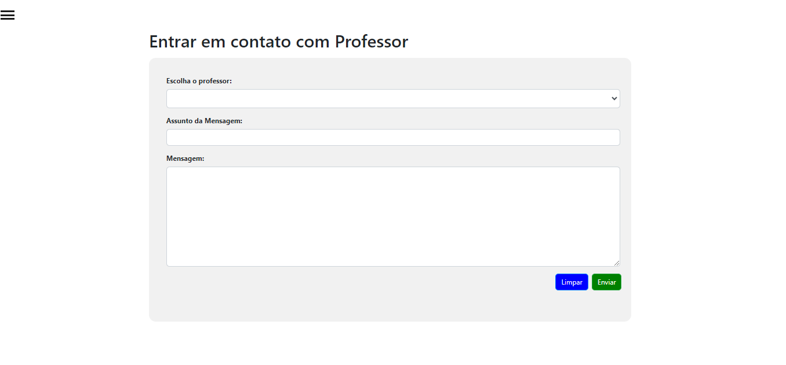

# Instruções de uso

## Página Principal

Na página principal temos uma landing page, onde você pode ver um breve anúncio sobre a escola, o que ela oferece e seus contatos. A interface é intuitiva, destacando-se pela simplicidade e pelo acesso direto aos recursos mais importantes: o botão de Login e o de Matrícula Online.

Localizados na parte superior, estes botões são seu portal para se conectar conosco. O botão de Login é projetado para alunos, professores e diretores que buscam acessar áreas exclusivas do site, facilitando a autenticação de forma segura e eficiente. Já o botão de Matrícula Online é uma via direta para futuros alunos que desejam se juntar à nossa comunidade acadêmica, bem como para professores interessados em fazer parte de nossa equipe, permitindo-lhes submeter suas informações e dar o primeiro passo em direção a uma jornada enriquecedora neste instituto.

## Matrícula online de alunos

Basicamente o aluno só precisa inserir os seus dados e esperar seu pedido ser aprovado ou rejeitado pelo Diretor. Caso seja aprovado o aluno deverá levar seus documentos pessoalmente no instituto.

## Matrícula online de professores

Basicamente o professor só precisa inserir os seus dados e esperar seu pedido ser aprovado ou rejeitado pelo Diretor. Caso seja aprovado o professor deverá levar seus documentos pessoalmente no instituto.

## Página de login dos alunos

Página de Login, basta o aluno utilizar o CPF e a senha utilizada na matrícula, seja online ou presencial.

## Página de login dos professores

Página de Login, basta o professor utilizar o CPF e a senha utilizada na matrícula, seja online ou presencial.

## Página de login do Diretor

Página de Login, basta o diretor utilizar o login e a senha única do sistema.

## Página inicial do aluno

Página simples em que temos alguns dados básicos do aluno e um calendário que se autoatualiza. No canto temos o botão para acessar a sidebar.

## Página de Disciplinas e Sidebar

Aqui vemos como a sidebar funciona e as páginas que podemos acessar com ela. Na página de disciplinas vamos ter o nome das disciplinas, o plano de ensino, os materiais enviados pelo professor e a nota final, caso o aluno tenha nota >=5 estará escrito "aprovado" em verde, se a nota ainda não foi lançada estará escrito "Cursando" em azul, e se a nota for menor que 5 estará escrito "Reprovado" em vermelho.

Ao clicar em "Ver informações":

## Página para o aluno enviar email para o professor
Nesta página podemos selecionar o professor (Só aparecerá os professores que o aluno tem) para enviar um email caso seja necessário entrar em contato com o professor. Ao clicar em enviar o professor receberá o email automaticamente.

## Configurações da conta do aluno
Nesta página o aluno poderá modificar determinadas informações e também poderá atualizar a sua foto de perfil.

## Página principal da conta do professor
Nesta página o professor poderá ver suas informações básicas, enviar o plano de ensino da matéria para os alunos e enviar materiais de apoio. Além de um calendário que se autoatualiza.

## Página para o professor alugar salas ou equipamentos
Nesta página o professor poderá realizar pedidos para a escola a fim de conseguir salas como laboratórios ou bibliotecas para instruir os alunos. E também poderá pedir equipamentos como projetor, computadores. Ao clicar em enviar, o pedido irá para o diretor se o professor aprovar ou reprovar o professor receberá um email personalizado com a resposta, caso seja aprovado outro email será enviado para o email que cuida da provisão de pedidos escolares.

## Página para o professor subir a nota de alunos
Nesta página o professor poderá subir a nota dos alunos, o que determinará a situação do aluno.

Ao clicar em "Atribuir nota":

## Configurações do professor
Nesta página o professor poderá configurar e editar informações básicas da sua conta e poderá alterar sua foto de perfil.

